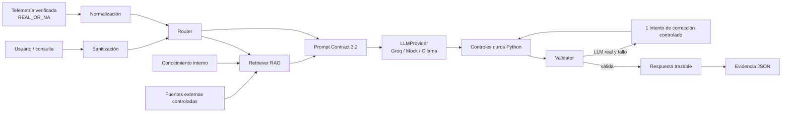

# Arquitectura CorePulse AI · ISY0101

## Autoridad de cada capa

- **Telemetría/normalización:** decide qué valores son reales y cuáles quedan `N/A`.
- **Router:** selecciona `cpu`, `gpu`, `memory`, `storage`, `network`, `system` o `general`.
- **RAG:** recupera máximo cuatro fragmentos y registra `retrieval_trace`.
- **LLM:** interpreta y redacta; no puede modificar sensores ni el manifiesto de fuentes.
- **Validator:** comprueba estructura, citas, `REAL_OR_NA` y contradicciones detectables.
- **Evidence gate:** solo guarda evidencia final cuando la salida es válida; `demo_llm_real*.json` requiere proveedor real.

El repositorio académico es ejecutable de forma independiente con JSON de ejemplo. El modo `--live` se usa únicamente cuando este módulo está integrado dentro del proyecto CorePulse completo.
